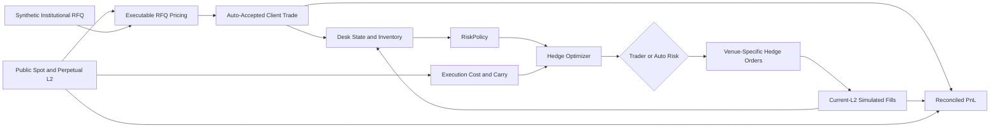

# FlowHedge

FlowHedge is a real-time institutional crypto RFQ, hedge-management, and desk PnL system. It consumes public BTC Spot and Perpetual order books from Kraken, Coinbase, and OKX to price client flow, maintain fill-based inventory, build cost-aware hedge plans, simulate multi-venue execution, and reconcile session PnL.

The system is designed around explicit accounting boundaries: recommendations do not change positions, orders affect only working and projected exposure, and only completed client trades or hedge fills affect actual inventory and PnL. Stale or incomplete market inputs fail closed instead of producing unsupported prices or hedge decisions.

FlowHedge uses public market data only. It does not require exchange credentials and does not submit live orders.

## Core capabilities

- Normalized BTC Spot and Perpetual L2 books across Kraken, Coinbase, and OKX
- Synthetic institutional RFQ flow with a strict notional threshold above USD 500,000
- Executable, multi-venue RFQ pricing based on reachable Spot liquidity
- Fill-driven inventory, delta, working-order, and projected-exposure accounting
- RiskPolicy with soft and hard USD delta bands, a grace period, and a bounded auto-hedge target
- L2 sweep, VWAP, slippage, fees, liquidity shortfall, and Perpetual carry economics
- Deterministic marginal-cost allocation across eligible venues and instruments
- Trader acceptance of system plans or manual multi-venue allocation
- Current-book simulated execution with auditable orders, fills, and batch metrics
- Reconciled session PnL with realized, unrealized, fee, spread, and execution attribution

## System flow



Client orders arrive asynchronously, so the desk can receive additional flow while prior exposure remains open. Opposing client flow naturally offsets the existing position before any new external hedge is required.

## Architecture

| Layer | Responsibility | Main location |
| --- | --- | --- |
| Trading workstation | Market panels, RFQ inbox, risk, recommendations, execution, blotters, and PnL | `app/` |
| API and orchestration | Runtime lifecycle, coherent workspace reads, and command endpoints | `backend/main.py` |
| Domain and accounting | Trading records, validation, and fill-driven desk-state transitions | `backend/domain/`, `backend/demo.py` |
| Market data | Venue adapters, normalization, connection state, and atomic snapshots | `backend/market/` |
| Pricing | Executable client quote construction and quote metadata | `backend/pricing/` |
| Risk | Exposure classification, hedge targets, grace-period state, and auto-hedge requirements | `backend/risk/` |
| Hedge economics | Immediate L2 execution cost and expected Perpetual carry | `backend/execution_cost/`, `backend/hedge_economics/` |
| Optimization | Candidate eligibility and marginal-cost hedge allocation | `backend/hedge_optimizer/` |
| Hedge workflows | Trader advisory plans and hard-limit auto-hedge orchestration | `backend/advisory/`, `backend/auto_hedge/` |
| Execution | Manual previews, venue-specific orders, simulated fills, and metrics | `backend/simulated_execution/` |
| PnL | Average-cost ledgers, valuation, attribution, and reconciliation | `backend/pnl/` |

The React 19 interface runs through Vinext/Vite. The backend is an asynchronous FastAPI application. Runtime trading state is held in memory, while model boundaries keep the services independently testable and replaceable.

## Market coverage

| Venue | Instrument | Native symbol | Contract model |
| --- | --- | --- | --- |
| Kraken | Spot | `BTC/USD` | Base asset |
| Kraken | Perpetual | `PI_XBTUSD` | Inverse |
| Coinbase | Spot | `BTC-USD` | Base asset |
| Coinbase | Perpetual | `BTC-PERP-INTX` | Linear |
| OKX | Spot | `BTC-USDT` | Base asset |
| OKX | Perpetual | `BTC-USDT-SWAP` | Linear |

Each adapter publishes a common market identity, normalized bids and asks, timestamps, sequence metadata, connection health, and data-quality state. The UI displays five levels, while executable calculations can consume up to 200 legitimate venue levels. Missing depth is never synthesized.

USDT and USDC are treated as USD at 1:1 under a visible runtime assumption.

## Trading models

### Client flow and RFQ pricing

The client-flow service generates BTC orders dynamically from current market prices. Every RFQ must satisfy:

```text
quantity_btc × reference_price_usd > 500,000 USD
```

Orders arrive at a randomized interval of 75–105 seconds by default, support both client BUY and SELL sides, and use 0.01 BTC quantity precision. The interface shows a short pricing state before treating the quote as accepted; client decline behavior is outside the current scope.

Pricing sweeps eligible, fresh Spot books for the full client quantity. It combines executable VWAP, configured taker cost, and client margin, then rounds adversely to the configured price increment. The reference is the median of eligible USD-converted Spot mids, and quotes expire after five seconds. If the required executable inputs are unavailable, pricing does not fall back to an invented quote.

### Position and risk accounting

The state model separates four quantities:

- **Actual delta** changes only after client trades or hedge fills.
- **Working delta** represents signed quantities on open hedge orders.
- **Projected delta** is actual delta plus working delta.
- **Inventory age** measures how long non-zero actual exposure has remained open.

Default RiskPolicy thresholds are centrally configured:

| State | Absolute delta notional | Behavior |
| --- | ---: | --- |
| GREEN | Up to USD 1,000,000 | No required hedge |
| YELLOW | Above USD 1,000,000 and up to USD 3,000,000 | Advisory hedge toward the signed soft limit |
| RED | Above USD 3,000,000 | Advisory target at the signed soft limit; hard-breach grace period starts |

If RED persists for five seconds without sufficient intervention, the system emits an auto-hedge requirement targeting 90% of the soft limit: USD 900,000 by default. The target is reduced exposure, not an automatic flatten to zero.

Risk notional uses the median of fresh Kraken and Coinbase USD Spot references. One healthy source can sustain a degraded assessment; if neither is usable, risk-sensitive actions hold rather than rely on a stale reference.

### Executable cost and hedge economics

For each candidate, the execution-cost engine sweeps the correct side of the normalized L2 book and returns:

- Executable quantity and shortfall
- VWAP and worst reached price
- Arrival-mid slippage and price impact
- Filled notional and configured taker fee
- Source snapshot and data-quality metadata

Spot carry is zero. Perpetual economics add expected funding events across the configured holding horizon. Predicted funding is preferred; current funding can be used with degraded quality, while missing required schedules or rates make the candidate ineligible. Expected funding is an optimization input only and is not booked as actual PnL.

### Hedge optimizer and execution

The deterministic `GREEDY_MARGINAL_L2_V1` allocator evaluates eligible marginal liquidity across all six venue/instrument candidates. It combines immediate execution cost, fee, and applicable carry economics, then allocates the requested BTC-equivalent quantity without exceeding reachable depth.

In advisory mode, the trader can accept the generated plan or switch to manual override. Manual allocation currently supports four directly editable routes:

- Coinbase Spot
- Kraken Spot
- OKX Spot
- OKX Perpetual

A manual preview validates direction, maximum quantity, current exposure, market freshness, and executable depth against one atomic snapshot. Submission creates venue-specific working orders; execution then sweeps the latest L2 and records realized VWAP, slippage, fees, fill quantity, and any shortfall.

For a persistent hard-limit breach, the same optimizer drives automatic simulated hedging and re-assessment until absolute exposure is at or below the configured USD 900,000 target, subject to eligible liquidity.

## PnL and reconciliation

PnL is session-to-date from the latest reset and is rebuilt from completed client trades and hedge fills. RFQs, quotes, recommendations, and unfilled orders never enter the ledger.

The engine maintains one consolidated Spot average-cost ledger and separate Perpetual ledgers by venue and instrument. It reports:

- Client spread capture versus the quote reference mid
- Gross realized trading PnL from position reductions and reversals
- Actual simulated hedge fees and net realized PnL
- Spot unrealized MTM from a fresh consolidated Spot mark
- Perpetual unrealized MTM from a fresh venue mark or executable midpoint fallback
- Hedge slippage versus expected VWAP and implementation shortfall versus arrival mid
- Residual inventory market movement
- Total desk PnL and reconciliation status

The core identities are:

```text
Net Realized PnL = Gross Realized PnL − Trading Fees

Total Desk PnL = Net Realized PnL
               + Spot Unrealized MTM
               + Perpetual Unrealized MTM

Total Desk PnL = Client Spread Capture
               − Hedge Implementation Shortfall
               − Trading Fees
               + Inventory Market Movement
```

Hedge slippage versus expected VWAP is reported as a separate execution diagnostic rather than counted again in the attribution bridge. The accounting total is independently checked against transaction cash plus marked open positions. A total is published only when required marks and fees are available and the difference is within USD 0.01. Otherwise, the snapshot is explicitly `PARTIAL` or `UNRECONCILED` and exposes data-quality flags.

## Runtime configuration

The principal assumptions are centralized in `backend/config.py`:

| Setting | Default |
| --- | ---: |
| Minimum client RFQ notional | Strictly above USD 500,000 |
| Client-flow interval | 75–105 seconds |
| Quote acceptance delay | 1.5 seconds |
| Quote validity | 5 seconds |
| Client margin | 5.0 bps |
| Taker fee | 2.0 bps |
| Expected hedge horizon | 4 hours |
| Soft delta limit | USD 1,000,000 |
| Hard delta limit | USD 3,000,000 |
| Hard-breach grace period | 5 seconds |
| Auto-hedge target | USD 900,000 |
| Stablecoin conversion | USDT/USD and USDC/USD at 1.0 |

These are illustrative desk assumptions, not exchange fee schedules or institutional account terms.

## Run locally

### Prerequisites

- Node.js 22.13.0 or newer
- Python 3.9 or newer
- Internet access to the supported public exchange feeds

### Install

```bash
git clone https://github.com/stefanSuYiGuo/FlowHedge.git
cd FlowHedge
npm ci

python3 -m venv .venv
source .venv/bin/activate
python -m pip install -r backend/requirements.txt
```

### Start the backend

```bash
source .venv/bin/activate
python -m uvicorn backend.main:app --host 127.0.0.1 --port 8000
```

### Start the frontend

In a second terminal:

```bash
npm run dev
```

Open:

- Trading workstation: [http://localhost:3000](http://localhost:3000)
- API health: [http://127.0.0.1:8000/health](http://127.0.0.1:8000/health)
- Interactive API documentation: [http://127.0.0.1:8000/docs](http://127.0.0.1:8000/docs)

The frontend uses `http://127.0.0.1:8000` by default. Set `NEXT_PUBLIC_FLOWHEDGE_API_URL` before starting the frontend to use a different API origin.

## Typical session

1. Wait for the market header to show healthy public feeds and populated normalized books.
2. Observe a client RFQ move from pricing to accepted, then verify actual delta and risk update.
3. Review the system hedge recommendation, its route allocation, and economic explanation.
4. Accept the system plan or enter a manual venue allocation, preview it, and execute the simulated batch.
5. Confirm that fills—not orders—change inventory, then inspect execution metrics, risk re-assessment, blotters, event tape, and reconciled PnL.

The client-flow control can be paused or resumed without predicting the arrival time of the next order. Reset clears the in-memory trading session and starts a fresh accounting period.

## API overview

| Area | Representative routes |
| --- | --- |
| System | `GET /health` |
| Market data | `GET /market/connections`, `GET /market/snapshots/{base_asset}`, `GET /market/books/{venue}/{instrument_type}/{symbol}` |
| Execution analytics | `POST /analytics/execution-cost/estimate`, `POST /analytics/execution-cost/compare` |
| Hedge economics | `POST /analytics/hedge-economics/estimate`, `POST /analytics/hedge-economics/compare` |
| RFQ validation | `POST /rfqs/validate` |
| Workspace and PnL | `GET /demo/workspace`, `GET /demo/pnl` |
| Risk | `GET /risk/assessment` |
| Manual execution | `POST /demo/manual-hedges/preview`, `POST /demo/manual-hedges/submit`, `POST /demo/execution-batches/{batch_id}/execute` |
| Advisory plans | `POST /demo/advisory-hedge-plans/{plan_id}/accept`, `POST /demo/advisory-hedge-plans/{plan_id}/reject` |
| State and audit | `GET /desk/state`, `GET /events`, `GET /demo/hedge-orders`, `GET /demo/hedge-fills` |

The `/docs` page contains the complete request and response schemas. Pricing and hedge optimization are normally orchestrated through the coherent workspace workflow rather than exposed as independent command endpoints.

## Verification

Run frontend checks from the repository root:

```bash
npm run lint
npm test
```

Run backend tests with the virtual environment active:

```bash
source .venv/bin/activate
python -m pytest -q
```

The test suites cover state transitions, market normalization, pricing, risk, L2 execution cost, funding economics, optimizer allocation, advisory and automatic hedge workflows, manual execution, PnL accounting, reconciliation, API behavior, and rendered UI output.

## Current scope and limitations

- Client RFQs are synthetic and accepted automatically after the pricing state.
- Hedge execution is simulated against current public L2; it does not model exchange queue priority, network latency, rejects, or partial exchange acknowledgements.
- No private exchange accounts, balances, margin state, or live order entry are used.
- Fees, hedge horizon, stablecoin parity, and risk limits are configurable assumptions.
- Expected funding affects hedge selection, but actual funding cashflows are not accrued into PnL.
- Borrow cost, financing, rebates, liquidation mechanics, and tax are not modeled.
- Runtime state and session PnL are in memory and reset on process restart.
- Perpetual exposure and PnL are expressed as linearized BTC-equivalent economics.
- The current market universe is BTC only.

## Possible extensions

- Inventory-aware client pricing
- Internalization and external-hedge savings analytics
- Full concurrent plan invalidation and re-optimization as client flow changes
- Persistent event, trade, and PnL storage
- Account-specific fee tiers, margin, borrow, and realized funding
- Additional assets, venues, order types, and production execution connectors
